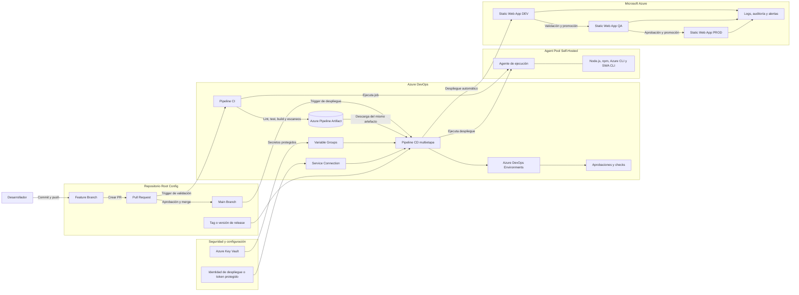
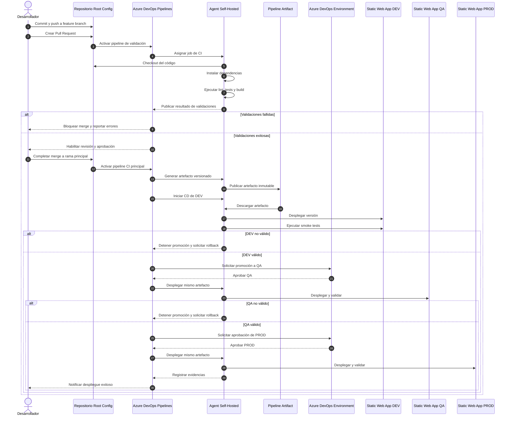
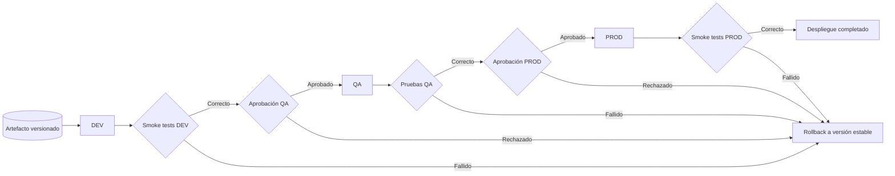

# Propuesta de arquitectura CI/CD para Root Config con Single-SPA

## Control del documento

| Campo | Valor |
|---|---|
| Historia de usuario | HU-01: Diseñar la arquitectura de CI/CD del Root Config |
| Estado | Propuesta inicial |
| Versión | 1.1 |
| Fecha | 10/09/2026 |
| Alcance | Root Config de Single-SPA desplegado en Azure Static Web Apps mediante Azure DevOps Pipelines y Agent Pool Self-Hosted |

## 1. Objetivo

Definir y documentar la arquitectura de integración continua y despliegue continuo del **Root Config de Single-SPA**, desde el commit del desarrollador hasta el despliegue en **Azure Static Web Apps**, utilizando **Azure DevOps Pipelines** y un **Agent Pool Self-Hosted**.

La propuesta contempla:

- Flujo de Pull Request y validación continua.
- Compilación y publicación de un artefacto inmutable.
- Promoción controlada entre ambientes.
- Separación lógica entre CI y CD.
- Uso de variables y secretos por ambiente.
- Aprobaciones para ambientes críticos.
- Pruebas posteriores al despliegue.
- Trazabilidad, evidencias y rollback.

## 2. Alcance

### 2.1 Incluido

- Repositorio del Root Config.
- Estrategia de ramas y Pull Requests.
- Azure DevOps Pipelines.
- Agent Pool Self-Hosted.
- Compilación, pruebas y publicación de artefactos.
- Despliegue hacia Azure Static Web Apps.
- Ambientes DEV, QA y PROD como propuesta base.
- Gestión de secretos mediante Azure Key Vault o grupos de variables protegidos.
- Aprobaciones, validaciones, smoke tests y rollback.
- Diagramas en Mermaid y documentación del flujo end-to-end.

### 2.2 Fuera de alcance de esta HU

- Implementación del pipeline YAML.
- Creación de recursos mediante Terraform.
- CI/CD individual de los microfrontends con GitHub Actions.
- Configuración funcional interna de cada microfrontend.
- Implementación de observabilidad de negocio.

## 3. Supuestos de la propuesta

1. El Root Config se administra en un repositorio accesible desde Azure DevOps.
2. El proyecto utiliza Node.js y un administrador de paquetes como npm.
3. El resultado del build es contenido estático compatible con Azure Static Web Apps.
4. Existe, o se creará mediante IaC, un recurso de Azure Static Web Apps por ambiente.
5. El Agent Pool Self-Hosted tiene conectividad saliente hacia Azure DevOps, Azure y los repositorios o registros de paquetes requeridos.
6. Se genera un único artefacto versionado en CI y el mismo artefacto se promueve entre ambientes.
7. DEV puede desplegarse automáticamente, QA puede requerir aprobación y PROD debe requerir aprobación manual.
8. Los secretos no se almacenan en el repositorio ni directamente en el archivo YAML.

## 4. Diagrama de arquitectura CI/CD

## 5. Flujo detallado desde el commit hasta el despliegue

### 5.1 Desarrollo y creación del cambio

1. El desarrollador actualiza su rama base local.
2. Crea una rama de trabajo siguiendo la convención acordada, por ejemplo `feature/12345-descripcion`.
3. Implementa el cambio en el Root Config.
4. Ejecuta localmente las validaciones mínimas:
   - Instalación reproducible de dependencias.
   - Lint.
   - Pruebas unitarias.
   - Build de producción.
5. Realiza commit y push de la rama.

### 5.2 Pull Request y validación CI

1. El desarrollador crea un Pull Request hacia la rama principal definida.
2. La política de rama activa el pipeline de validación.
3. Azure DevOps asigna el job al Agent Pool Self-Hosted.
4. El agente realiza checkout del código.
5. Se instala la versión de Node.js definida por el proyecto.
6. Se restauran dependencias con un mecanismo reproducible, por ejemplo `npm ci`.
7. Se ejecutan las siguientes validaciones:
   - Formato y lint.
   - Pruebas unitarias.
   - Cobertura mínima, si aplica.
   - Análisis de dependencias y vulnerabilidades.
   - Build de producción.
8. Si alguna validación falla, el pipeline se marca como fallido y el merge queda bloqueado.
9. Si todas las validaciones son exitosas, el Pull Request queda habilitado para revisión y aprobación.

### 5.3 Merge, generación y publicación del artefacto

1. El Pull Request es aprobado según las políticas definidas.
2. El cambio se integra a la rama principal.
3. Se ejecuta el pipeline CI de la rama principal.
4. El agente vuelve a ejecutar las validaciones y genera el build definitivo.
5. El contenido desplegable se empaqueta como un artefacto inmutable.
6. El artefacto se identifica con metadatos como:
   - Build ID.
   - Commit SHA.
   - Rama de origen.
   - Fecha y hora.
   - Versión o tag, si aplica.
7. Azure DevOps publica el artefacto para su consumo por el pipeline CD.

### 5.4 Despliegue a DEV

1. El pipeline CD descarga el artefacto generado por CI.
2. Recupera la configuración no sensible y los secretos autorizados para DEV.
3. Ejecuta validaciones previas, como disponibilidad del agente, existencia del artefacto y acceso al recurso Azure.
4. Despliega el artefacto a Azure Static Web Apps DEV.
5. Ejecuta smoke tests, por ejemplo:
   - Respuesta HTTP exitosa.
   - Carga del Root Config.
   - Resolución de `import-map` o mecanismo equivalente.
   - Carga básica de los microfrontends configurados.
6. Registra la versión desplegada y las evidencias.
7. Si la validación falla, se detiene la promoción y se inicia el procedimiento de rollback.

### 5.5 Promoción a QA

1. El mismo artefacto aprobado en DEV se selecciona para QA.
2. Azure DevOps Environment evalúa checks y aprobación, si está configurada.
3. Se cargan únicamente las variables y secretos de QA.
4. El Agent Pool Self-Hosted despliega el artefacto en Azure Static Web Apps QA.
5. Se ejecutan smoke tests y pruebas de integración.
6. Se registra la evidencia de la promoción.

### 5.6 Promoción a PROD

1. Se valida que la versión haya superado DEV y QA.
2. Se solicita aprobación manual a los responsables autorizados.
3. Se valida la ventana de despliegue y la ausencia de ejecuciones concurrentes.
4. Se descarga el mismo artefacto, sin recompilarlo.
5. Se cargan las variables y secretos de PROD.
6. El agente despliega el artefacto en Azure Static Web Apps PROD.
7. Se ejecutan smoke tests de producción.
8. Se registra la versión, aprobadores, tiempos, resultado y evidencias.
9. Se notifica el resultado a los interesados.

## 6. Diagrama de secuencia end-to-end

## 7. Modelo de promoción entre ambientes

## 8. Matriz propuesta de ambientes

| Ambiente | Rama o evento | Despliegue | Aprobación | Recurso objetivo | Validación mínima |
|---|---|---|---|---|---|
| DEV | Merge a rama principal | Automático | No requerida | Azure Static Web Apps DEV | Smoke tests técnicos |
| QA | Promoción de artefacto aprobado en DEV | Controlado | Líder técnico o QA | Azure Static Web Apps QA | Smoke tests y pruebas de integración |
| PROD | Release o promoción desde QA | Controlado | Negocio, Operaciones o responsable designado | Azure Static Web Apps PROD | Smoke tests, monitoreo y evidencia |

> La relación definitiva entre ramas y ambientes debe validarse con la estrategia Git del proyecto. Se recomienda evitar recompilar por ambiente y promover el mismo artefacto.

## 9. Diseño lógico de los pipelines

### 9.1 Pipeline CI

Etapas propuestas:

1. **Checkout**
2. **Preparación del entorno**
3. **Restauración de dependencias**
4. **Lint y formato**
5. **Pruebas unitarias**
6. **Análisis de seguridad y calidad**
7. **Build de producción**
8. **Empaquetado**
9. **Publicación del artefacto**
10. **Publicación de reportes y evidencias**

### 9.2 Pipeline CD

Etapas propuestas:

1. **Descarga del artefacto**
2. **Validaciones previas**
3. **Despliegue DEV**
4. **Smoke tests DEV**
5. **Aprobación y despliegue QA**
6. **Pruebas QA**
7. **Aprobación y despliegue PROD**
8. **Smoke tests PROD**
9. **Registro de versión y evidencias**
10. **Notificación**

## 10. Agent Pool Self-Hosted

El agente debe contar, como mínimo, con:

- Sistema operativo soportado y actualizado.
- Azure Pipelines Agent instalado como servicio.
- Node.js en la versión requerida por el Root Config.
- npm u otro administrador de paquetes definido.
- Azure CLI.
- Azure Static Web Apps CLI o tarea de despliegue equivalente.
- Certificados corporativos, configuración de proxy y reglas de red, si aplican.
- Acceso saliente a Azure DevOps, Azure, feeds de paquetes y endpoints requeridos.
- Espacio en disco y limpieza automática del workspace.
- Cuenta de servicio con permisos mínimos.
- Monitoreo de disponibilidad, consumo y versión del agente.

### Recomendación de operación

- No ejecutar varios agentes con la misma identidad o directorio de trabajo.
- Mantener inventario de capabilities y demands.
- Actualizar periódicamente el software del agente.
- Evitar persistir secretos en disco o logs.
- Implementar al menos un mecanismo de contingencia para indisponibilidad.

## 11. Seguridad

1. Usar una identidad de despliegue con privilegios mínimos.
2. Evaluar Workload Identity Federation o una Service Connection aprobada en lugar de secretos de larga duración, cuando el método de despliegue lo permita.
3. Si se utiliza un deployment token de Static Web Apps, almacenarlo como secreto protegido, limitar su lectura y definir rotación.
4. No imprimir secretos en logs.
5. Separar variables y permisos por ambiente.
6. Restringir quién puede aprobar y desplegar a PROD.
7. Habilitar trazabilidad de cambios, ejecuciones y aprobaciones.
8. Aplicar protección a la rama principal y revisión obligatoria de Pull Requests.

## 12. Estrategia de rollback

### 12.1 Condiciones de activación

- Fallo en smoke tests.
- Error de carga del Root Config.
- Incompatibilidad con import maps o microfrontends.
- Error funcional crítico detectado después del despliegue.
- Degradación de disponibilidad.

### 12.2 Procedimiento propuesto

1. Detener promociones posteriores.
2. Identificar la última versión estable del artefacto.
3. Ejecutar un redeploy controlado del artefacto anterior.
4. Ejecutar smoke tests.
5. Confirmar recuperación del servicio.
6. Registrar incidente, versión fallida y versión restaurada.
7. Notificar a los interesados.

> El rollback debe desplegar un artefacto previamente validado. No debe realizarse una recompilación de emergencia del código anterior.

## 13. Evidencias y trazabilidad

Cada ejecución debe conservar:

- Commit SHA y rama.
- Pull Request asociado.
- Resultado de lint y pruebas.
- Reporte de cobertura, si aplica.
- Reporte de seguridad, si aplica.
- Identificador y hash del artefacto.
- Ambiente de destino.
- Responsable y aprobadores.
- Fecha y duración del despliegue.
- Resultado de smoke tests.
- Versión anterior y versión desplegada.
- Logs del pipeline y enlace a la ejecución.

## 14. Herramientas para crear y mantener los diagramas Mermaid

### Opción recomendada: repositorio Markdown

Mantener este archivo `.md` junto con el código o en el repositorio documental. Esto permite:

- Versionar el diagrama como código.
- Revisar cambios mediante Pull Requests.
- Mantener la documentación cerca de la implementación.
- Evitar archivos binarios difíciles de comparar.

### Herramientas compatibles

1. **Mermaid Live Editor**
   - Edición y previsualización en navegador.
   - Exportación a SVG o PNG.
   - Útil para validar rápidamente la sintaxis.

2. **Visual Studio Code**
   - Edición local del archivo Markdown.
   - Extensiones de previsualización Mermaid.
   - Adecuado para revisión y versionamiento Git.

3. **GitHub**
   - Renderiza bloques Mermaid en archivos Markdown compatibles.
   - Facilita revisión del diagrama mediante Pull Requests.

4. **Azure DevOps Wiki**
   - Puede utilizarse para publicar documentación técnica.
   - La compatibilidad de Mermaid debe validarse en la organización y extensión instalada.

5. **Mermaid CLI**
   - Permite renderizar diagramas en automatizaciones.
   - Puede generar SVG, PNG o PDF a partir de archivos Mermaid.
   - Puede integrarse en un pipeline para validar y publicar los diagramas.

### Flujo recomendado de mantenimiento

1. Editar el bloque Mermaid en Visual Studio Code.
2. Validar la sintaxis en la previsualización o Mermaid Live Editor.
3. Crear Pull Request con el cambio documental.
4. Revisar el diagrama junto con Arquitectura, DevOps, Seguridad y Desarrollo.
5. Aprobar y fusionar el cambio.
6. Exportar SVG o PNG solo cuando se requiera incluir el diagrama en herramientas sin soporte Mermaid.

## 15. Criterios de aceptación y cobertura

| Criterio de aceptación | Evidencia propuesta |
|---|---|
| Se genera un diagrama de arquitectura de CI/CD | Diagrama de la sección 4 |
| El diagrama incluye Azure DevOps Pipelines | Subgrafo Azure DevOps de la sección 4 |
| El diagrama incluye Agent Pool Self-Hosted | Subgrafo Agent Pool Self-Hosted de la sección 4 |
| El diagrama incluye Azure Static Web Apps | Recursos DEV, QA y PROD de la sección 4 |
| Se documenta el flujo desde el commit hasta el despliegue | Secciones 5 y 6 |
| Se identifican los ambientes a soportar | Secciones 7 y 8 |

## 16. Definition of Done propuesta

La HU se considera terminada cuando:

- Los diagramas Mermaid renderizan sin errores.
- El diseño incluye repositorio, CI, CD, agente Self-Hosted y Azure Static Web Apps.
- El flujo desde commit hasta PROD está documentado.
- Los ambientes y responsables están identificados.
- La estrategia de secretos, aprobaciones, evidencias y rollback está documentada.
- Arquitectura, DevOps, Seguridad, Desarrollo y Operaciones revisan la propuesta.
- Las observaciones quedan resueltas y registradas.
- La versión aprobada se almacena en el repositorio documental.

## 17. Datos pendientes por definir

Los siguientes datos no impiden revisar la propuesta, pero deben completarse antes de aprobar el diseño final:

- Nombre de la organización y proyecto de Azure DevOps.
- Nombre y ubicación del repositorio Root Config.
- Rama principal y estrategia de ramas.
- Nombre del Agent Pool Self-Hosted.
- Sistema operativo y capabilities del agente.
- Versión de Node.js y administrador de paquetes.
- Comando de instalación, lint, tests y build.
- Directorio de salida del build, por ejemplo `dist`.
- Ambientes definitivos: DEV, QA, UAT y PROD.
- Nombres y suscripciones de los recursos Azure Static Web Apps.
- Método de autenticación de despliegue.
- Fuente de secretos: Azure Key Vault o Variable Groups.
- Responsables de aprobación por ambiente.
- Herramienta de calidad y seguridad, si aplica.
- Endpoints y casos que formarán parte de los smoke tests.
- Canal de notificación del resultado.
- Tiempo de retención de artefactos y logs.
- RTO y procedimiento operativo de rollback.

## 18. Referencias

- Mermaid, sintaxis oficial de flowcharts: https://mermaid.ai/open-source/syntax/flowchart.html
- Mermaid, guía de uso y Live Editor: https://mermaid.ai/open-source/intro/getting-started.html
- Microsoft Learn, Azure Pipelines Agents: https://learn.microsoft.com/azure/devops/pipelines/agents/agents
- Microsoft Learn, despliegue con Azure Static Web Apps CLI: https://learn.microsoft.com/azure/static-web-apps/static-web-apps-cli-deploy
- Microsoft Learn, administración del deployment token de Azure Static Web Apps: https://learn.microsoft.com/azure/static-web-apps/deployment-token-management
