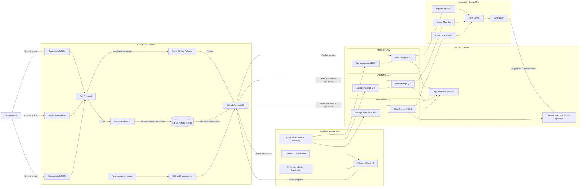
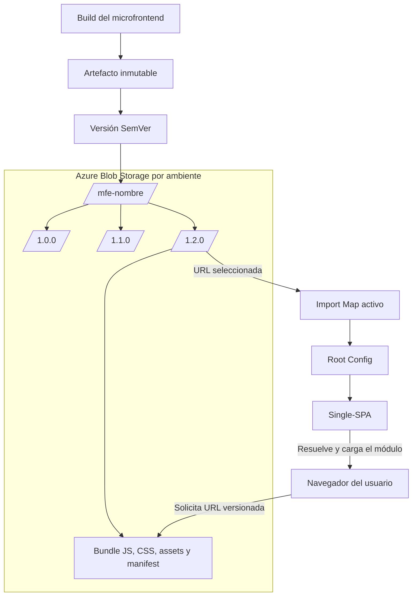
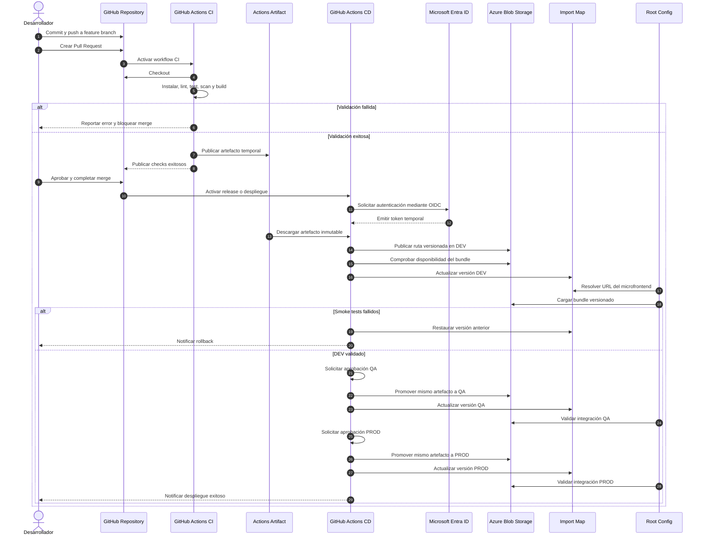
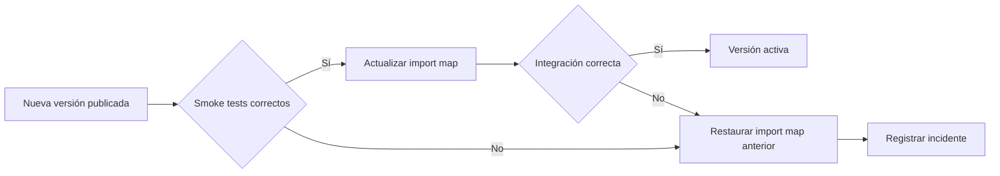

# Propuesta de arquitectura CI/CD para Microfrontends

## Control del documento

| Campo | Valor |
|---|---|
| Historia de usuario | HU-02: Diseñar la arquitectura de CI/CD para Microfrontends |
| Estado | Propuesta inicial |
| Versión | 1.0 |
| Fecha | 10/09/2026 |
| Alcance | Microfrontends Single-SPA administrados en GitHub, construidos con GitHub Actions y desplegados en Azure Blob Storage |

## 1. Objetivo

Definir y documentar la arquitectura de integración continua y despliegue continuo para microfrontends basados en **Single-SPA**, considerando repositorios independientes en **GitHub**, automatización con **GitHub Actions**, publicación de artefactos en **Azure Blob Storage** e integración controlada con el **Root Config**.

La propuesta contempla:

- Repositorio independiente por microfrontend.
- Validaciones automáticas en Pull Requests.
- Generación de artefactos versionados e inmutables.
- Autenticación de GitHub Actions con Azure mediante OIDC.
- Publicación en rutas versionadas de Azure Blob Storage.
- Promoción controlada entre DEV, QA y PROD.
- Integración con Root Config mediante import maps o manifiesto equivalente.
- Estrategia de versionamiento, compatibilidad y rollback.
- Seguridad, trazabilidad, observabilidad y gobierno de repositorios.

## 2. Alcance

### 2.1 Incluido

- Repositorios GitHub para los microfrontends.
- Políticas de ramas, Pull Requests y CODEOWNERS.
- Workflows de CI y CD con GitHub Actions.
- GitHub Environments, variables, secretos y aprobaciones.
- Identidad federada entre GitHub Actions y Microsoft Entra ID.
- Azure Storage Accounts y contenedores Blob de destino.
- Estructura de carpetas y artefactos versionados.
- Estrategia de integración con Root Config.
- Matriz de ambientes DEV, QA y PROD.
- Validaciones, evidencias, promoción y rollback.
- Diagramas Mermaid y flujo end-to-end.

### 2.2 Fuera del alcance de esta HU

- Implementación definitiva de archivos YAML de GitHub Actions.
- Creación de recursos Azure mediante Terraform.
- Implementación del pipeline del Root Config en Azure DevOps.
- Desarrollo funcional de los microfrontends.
- Configuración final de dominio, CDN o Azure Front Door.

## 3. Decisiones y supuestos de diseño

1. Cada microfrontend se administra en un repositorio GitHub independiente.
2. Los proyectos generan bundles estáticos JavaScript, CSS y assets compatibles con Single-SPA.
3. CI produce un artefacto único, versionado e inmutable.
4. El mismo artefacto se promueve entre ambientes sin recompilarse.
5. Las rutas desplegadas incluyen una versión, por ejemplo `/mfe-clientes/1.4.2/`.
6. El Root Config resuelve la ubicación de cada bundle mediante un import map o manifiesto por ambiente.
7. La actualización del import map es una operación explícita, trazable y reversible.
8. GitHub Actions se autentica con Azure mediante OIDC y una identidad federada, evitando secretos de larga duración.
9. Se propone un Storage Account por ambiente para aislar permisos, riesgos y configuraciones.
10. Azure Front Door o CDN se considera opcional para dominio, TLS, caché y encabezados HTTP.

## 4. Diagrama principal de arquitectura CI/CD



## 5. Arquitectura de publicación y consumo



### Estructura propuesta de publicación

```text
$web/
├── mfe-clientes/
│   ├── 1.3.0/
│   │   ├── mfe-clientes.js
│   │   ├── mfe-clientes.css
│   │   ├── assets/
│   │   └── manifest.json
│   └── 1.4.0/
│       ├── mfe-clientes.js
│       ├── mfe-clientes.css
│       ├── assets/
│       └── manifest.json
├── mfe-portafolios/
│   └── 2.1.0/
│       └── ...
└── import-maps/
    ├── import-map.dev.json
    ├── import-map.qa.json
    └── import-map.prod.json
```

> Si los artefactos se publican en un contenedor distinto de `$web`, debe definirse el endpoint público, los permisos de lectura y la capa de entrega. Para hosting estático nativo de Azure Storage, el contenido público se sirve desde `$web`.

## 6. Flujo desde el commit hasta el despliegue

### 6.1 Desarrollo local

1. El desarrollador sincroniza la rama principal.
2. Crea una rama de trabajo, por ejemplo `feature/12345-descripcion`.
3. Implementa el cambio en el microfrontend.
4. Ejecuta localmente las validaciones mínimas:
   - Instalación reproducible de dependencias.
   - Lint y formato.
   - Pruebas unitarias.
   - Build de producción.
   - Validación del contrato de integración con Single-SPA.
5. Realiza commit y push hacia GitHub.

### 6.2 Pull Request y CI

1. El desarrollador crea un Pull Request hacia la rama principal.
2. GitHub activa el workflow de CI.
3. El runner realiza checkout del código.
4. Se configura la versión de Node.js aprobada.
5. Se instalan dependencias mediante `npm ci` o mecanismo equivalente.
6. Se ejecutan:
   - Lint y validación de formato.
   - Pruebas unitarias.
   - Cobertura mínima.
   - Análisis de dependencias.
   - SAST, si aplica.
   - Build de producción.
   - Validación de tamaño de bundles.
   - Validación del `manifest.json`.
7. El artefacto de prueba se publica temporalmente como GitHub Actions Artifact.
8. Si una validación falla, el merge queda bloqueado.
9. Los CODEOWNERS y revisores autorizados aprueban el Pull Request.

### 6.3 Merge y creación de versión

1. El Pull Request aprobado se integra a la rama principal.
2. Se determina la nueva versión según Semantic Versioning.
3. Se crea un tag y, opcionalmente, un GitHub Release.
4. El workflow de release genera o recupera el artefacto inmutable.
5. Se registran como metadatos:
   - Nombre del microfrontend.
   - Versión.
   - Commit SHA.
   - Workflow Run ID.
   - Fecha y hora.
   - Hash del artefacto.

### 6.4 Autenticación con Azure

1. El job de despliegue solicita un token OIDC a GitHub.
2. Microsoft Entra ID valida el issuer, audience y subject configurados en la credencial federada.
3. Azure emite un token temporal para la identidad de despliegue.
4. La identidad utiliza un rol RBAC limitado al Storage Account o contenedor del ambiente.
5. No se utiliza un client secret permanente para conectar GitHub Actions con Azure.

### 6.5 Despliegue en DEV

1. El workflow descarga el artefacto versionado.
2. Verifica su hash e integridad.
3. Publica los archivos en una ruta nueva, por ejemplo `/mfe-clientes/1.4.0/`.
4. Configura metadatos y políticas de caché según el tipo de archivo.
5. Ejecuta smoke tests contra la URL del bundle.
6. Actualiza de forma controlada el import map de DEV para apuntar a la nueva versión.
7. Valida la carga del microfrontend desde el Root Config DEV.
8. Registra evidencias y notifica el resultado.

### 6.6 Promoción a QA

1. Se selecciona la misma versión aprobada en DEV.
2. GitHub Environment aplica reglas y aprobación de QA.
3. Se promueve el mismo artefacto al Storage Account QA.
4. Se actualiza el import map QA mediante Pull Request o workflow controlado.
5. Se ejecutan pruebas de integración y compatibilidad con Root Config.
6. Se registran resultados y aprobaciones.

### 6.7 Promoción a PROD

1. Se comprueba que la versión superó DEV y QA.
2. GitHub Environment solicita aprobación de producción.
3. Se valida ventana de despliegue y control de concurrencia.
4. Se publica el mismo artefacto en la ruta versionada de PROD.
5. Se valida la disponibilidad del bundle antes de modificar el import map.
6. Se actualiza el import map PROD de forma atómica y trazable.
7. Se ejecutan smoke tests desde el Root Config PROD.
8. Se verifica carga, errores de consola y disponibilidad.
9. Se registra versión, aprobadores, resultado y evidencias.

## 7. Diagrama de secuencia end-to-end



## 8. Estrategia de integración con Root Config

### 8.1 Mecanismo propuesto

El Root Config no debe contener un bundle embebido de cada microfrontend. Debe resolver su URL mediante un **import map** o manifiesto por ambiente.

Ejemplo conceptual:

```json
{
  "imports": {
    "@organizacion/mfe-clientes": "https://dominio-assets/mfe-clientes/1.4.0/mfe-clientes.js",
    "@organizacion/mfe-portafolios": "https://dominio-assets/mfe-portafolios/2.1.0/mfe-portafolios.js"
  }
}
```

### 8.2 Flujo de actualización

1. Se publica primero el bundle en una ruta versionada.
2. Se valida que la URL responda correctamente.
3. Se actualiza el import map del ambiente.
4. Se valida el esquema JSON y que las URLs existan.
5. Se registra el cambio en Git o como artefacto auditable.
6. Root Config recupera el import map al iniciar.
7. Single-SPA carga el microfrontend cuando corresponde por ruta o actividad.

### 8.3 Reglas de compatibilidad

- Cada microfrontend debe exponer los lifecycles esperados: `bootstrap`, `mount` y `unmount`.
- Las dependencias compartidas deben tener versiones compatibles.
- Los cambios incompatibles deben publicarse como versión mayor.
- Root Config no debe apuntar a archivos sobrescritos sin versión.
- Debe existir una matriz de compatibilidad entre Root Config, librerías compartidas y microfrontends críticos.

## 9. Estrategia de versionamiento

Se propone **Semantic Versioning**:

- **MAJOR**: cambio incompatible o ruptura de contrato.
- **MINOR**: funcionalidad compatible hacia atrás.
- **PATCH**: corrección compatible.

### Reglas propuestas

1. Cada release debe asociarse a un tag Git.
2. La versión debe quedar en la ruta de publicación.
3. Los bundles versionados no se sobrescriben.
4. El import map representa la versión activa por ambiente.
5. Los nombres de archivos pueden incluir hash para caché, manteniendo un manifiesto estable dentro de la carpeta versionada.
6. El workflow debe impedir publicar nuevamente una versión existente, salvo procedimiento excepcional autorizado.
7. La versión anterior debe conservarse durante el periodo de retención definido.

## 10. Estrategia de caché

- Archivos con hash o ruta versionada: caché prolongada e inmutable.
- Import maps y manifiestos activos: caché corta o `no-cache`, según la capa de entrega.
- La publicación debe finalizar antes de actualizar el puntero activo.
- No se recomienda eliminar inmediatamente versiones anteriores.
- Si se requieren encabezados avanzados, dominio personalizado o invalidación global, evaluar Azure Front Door o CDN.

## 11. Matriz propuesta de ambientes

| Ambiente | Evento de despliegue | Aprobación | Destino | Actualización de import map | Validación mínima |
|---|---|---|---|---|---|
| DEV | Merge o release elegible | Automática | Storage Account DEV | Automática y auditable | Bundle disponible y carga desde Root Config |
| QA | Promoción de versión aprobada | QA o líder técnico | Storage Account QA | Controlada | Integración, compatibilidad y regresión |
| PROD | Release aprobado | Responsables autorizados | Storage Account PROD | Controlada y atómica | Smoke tests, monitoreo y evidencia |

## 12. Diseño lógico de workflows

### 12.1 Workflow CI

1. Checkout.
2. Configuración de Node.js.
3. Caché segura de dependencias.
4. Instalación reproducible.
5. Lint y formato.
6. Pruebas y cobertura.
7. Análisis de seguridad.
8. Build de producción.
9. Validación de tamaño y contratos.
10. Empaquetado del artefacto.
11. Publicación de reportes y evidencias.

### 12.2 Workflow Release

1. Determinación de versión.
2. Creación del tag.
3. Generación o recuperación del artefacto.
4. Cálculo de hash.
5. Creación de GitHub Release.
6. Registro de notas y metadatos.

### 12.3 Workflow CD

1. Selección del artefacto.
2. Aprobación mediante GitHub Environment.
3. Autenticación OIDC con Azure.
4. Validación del destino.
5. Publicación en ruta versionada.
6. Validación de URL.
7. Actualización de import map.
8. Smoke tests desde Root Config.
9. Evidencias y notificación.
10. Rollback del import map si falla la validación.

## 13. Seguridad y gobierno

- Usar OIDC y credenciales federadas para evitar secretos Azure de larga duración.
- Separar identidad y permisos por ambiente.
- Limitar RBAC al Storage Account o contenedor requerido.
- Proteger los GitHub Environments de QA y PROD con revisores.
- Definir `permissions` mínimos en cada workflow.
- Fijar acciones de terceros a versiones o SHA aprobados.
- Proteger la rama principal y exigir checks exitosos.
- Usar CODEOWNERS.
- Evitar secretos en código, artefactos y logs.
- Habilitar análisis de dependencias y secretos.
- Definir reglas de retención y auditoría.
- Aplicar control de concurrencia para evitar despliegues simultáneos sobre un import map.

## 14. Estrategia de rollback

El rollback recomendado consiste en **restaurar el import map a la versión estable anterior**, no sobrescribir el bundle defectuoso.

### Procedimiento

1. Detener promociones posteriores.
2. Identificar la versión activa y la última versión estable.
3. Validar que el bundle anterior siga disponible.
4. Restaurar la URL anterior en el import map.
5. Publicar el import map de manera atómica.
6. Ejecutar smoke tests desde Root Config.
7. Confirmar recuperación.
8. Registrar incidente, versión fallida y versión restaurada.



## 15. Evidencias y trazabilidad

Cada ejecución debe conservar:

- Repositorio y nombre del microfrontend.
- Pull Request y commit SHA.
- Resultados de lint, pruebas, cobertura y seguridad.
- Versión SemVer y tag.
- Hash del artefacto.
- Workflow Run ID.
- Ruta y URL de publicación.
- Ambiente de destino.
- Identidad utilizada.
- Aprobadores.
- Import map anterior y nuevo.
- Resultado de smoke tests.
- Fecha, duración y conclusión del despliegue.

## 16. Herramientas para crear y mantener el diagrama

### Herramienta principal

**Mermaid** permite almacenar los diagramas como texto dentro de archivos Markdown, facilitando control de versiones, revisión mediante Pull Requests y mantenimiento conjunto con la documentación.

### Herramientas recomendadas

1. **Mermaid Live Editor**
   - Edición y previsualización inmediata.
   - Validación rápida de sintaxis.
   - Exportación a SVG o PNG.

2. **Visual Studio Code**
   - Edición local del archivo `.md`.
   - Previsualización mediante extensiones compatibles con Mermaid.
   - Integración natural con Git.

3. **GitHub**
   - Almacenamiento y revisión de la documentación.
   - Renderizado de bloques Mermaid en contextos compatibles.
   - Historial y aprobación mediante Pull Requests.

4. **Mermaid CLI**
   - Renderizado automático a SVG, PNG o PDF.
   - Validación de diagramas dentro de CI.
   - Generación de artefactos documentales.

5. **Azure DevOps Wiki**
   - Publicación opcional para consumo corporativo.
   - Se debe validar el soporte Mermaid disponible en la organización.

### Flujo de mantenimiento documental

1. Editar Mermaid en Visual Studio Code.
2. Validar en la previsualización o Mermaid Live Editor.
3. Crear Pull Request documental.
4. Revisar con Arquitectura, Frontend, DevOps y Seguridad.
5. Resolver observaciones.
6. Aprobar y fusionar.
7. Exportar SVG o PNG solo para herramientas que no rendericen Mermaid.

## 17. Cobertura de criterios de aceptación

| Criterio de aceptación | Evidencia en el documento |
|---|---|
| Se genera un diagrama de arquitectura | Secciones 4 y 5 |
| Se representa GitHub como repositorio fuente | Sección 4 |
| Se incluyen GitHub Actions | Secciones 4, 6, 7 y 12 |
| Se incluye Azure Blob Storage como destino | Secciones 4, 5 y 6 |
| Se documenta la integración con Root Config | Secciones 5, 7 y 8 |
| Se documenta la estrategia de versionamiento | Sección 9 |

## 18. Definition of Done propuesta

La HU-02 se considera terminada cuando:

- Los diagramas Mermaid renderizan sin errores.
- GitHub, GitHub Actions y Azure Blob Storage aparecen en la arquitectura.
- El flujo desde commit hasta consumo por Root Config está documentado.
- Los ambientes y promociones están definidos.
- La autenticación, permisos y aprobaciones están documentados.
- La estrategia de versionamiento e import maps está acordada.
- El rollback está definido y es comprobable.
- Arquitectura, Frontend, DevOps, Seguridad y Operaciones revisan la propuesta.
- Las observaciones se resuelven y la versión final queda aprobada.

## 19. Datos pendientes por definir

Los siguientes datos deben completarse antes de cerrar el diseño definitivo:

- Organización de GitHub.
- Lista y nombres de repositorios de microfrontends.
- Tipo de runners: GitHub-hosted o self-hosted.
- Rama principal y estrategia Git.
- Versión de Node.js y administrador de paquetes.
- Comandos reales de lint, test y build.
- Directorio de salida del build.
- Convención de nombre de bundles y módulos Single-SPA.
- Ambientes definitivos: DEV, QA, UAT y PROD.
- Storage Accounts y suscripciones por ambiente.
- Uso de `$web`, contenedores separados o capa CDN/Front Door.
- Dominio público de assets por ambiente.
- Ubicación y propietario de los import maps.
- Forma de actualizar import maps: Pull Request, API o workflow.
- Reglas de compatibilidad con Root Config y dependencias compartidas.
- Herramientas de calidad y seguridad.
- Responsables de aprobación por ambiente.
- Política de caché e invalidación.
- Tiempo de retención de bundles y artefactos.
- Smoke tests y pruebas de integración.
- Canal de notificación.
- RTO y responsables del rollback.

## 20. Referencias

- GitHub Docs, configuración de OpenID Connect en Azure: https://docs.github.com/actions/how-tos/secure-your-work/security-harden-deployments/oidc-in-azure
- Microsoft Learn, autenticación de GitHub Actions con Azure mediante OIDC: https://learn.microsoft.com/azure/developer/github/connect-from-azure-openid-connect
- Microsoft Learn, hosting de sitios estáticos en Azure Storage: https://learn.microsoft.com/azure/storage/blobs/storage-blob-static-website
- Microsoft Learn, publicación de contenido estático en Azure Storage: https://learn.microsoft.com/azure/storage/blobs/storage-blob-static-website-how-to
- Mermaid, sintaxis oficial de flowcharts: https://mermaid.ai/open-source/syntax/flowchart.html
- Mermaid Live Editor: https://mermaid.live/
